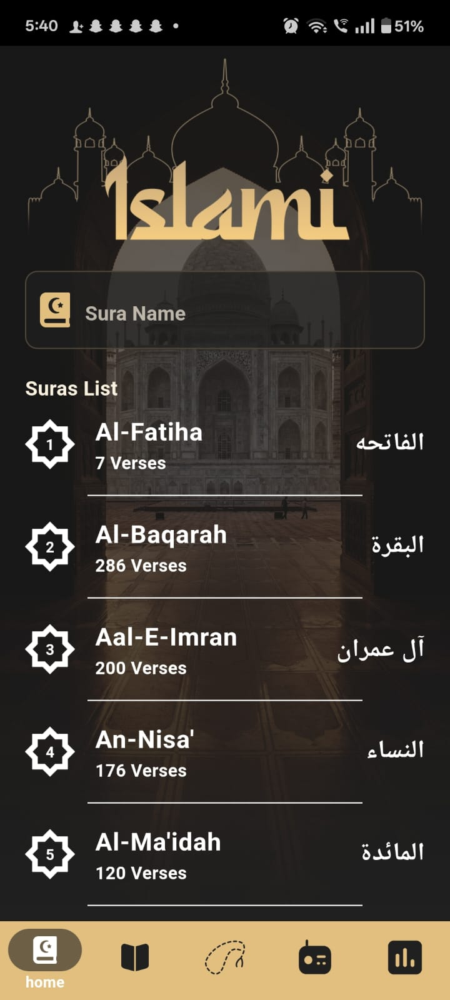
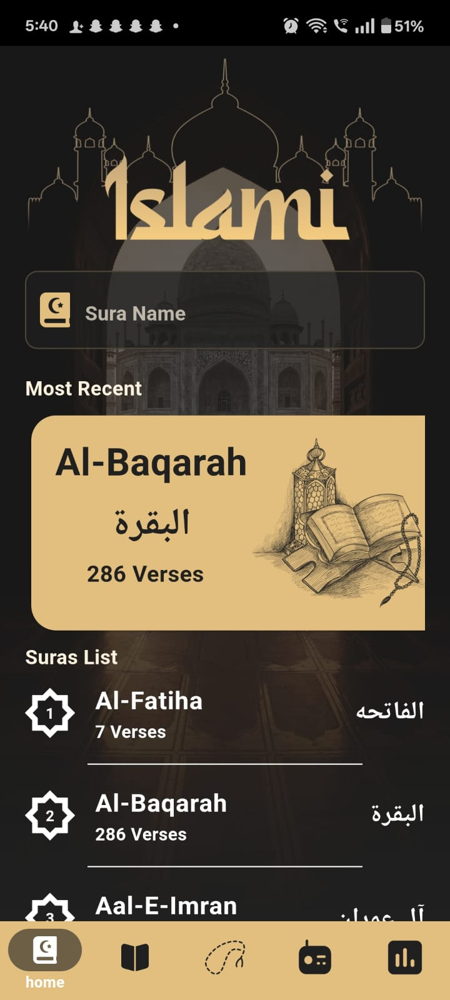
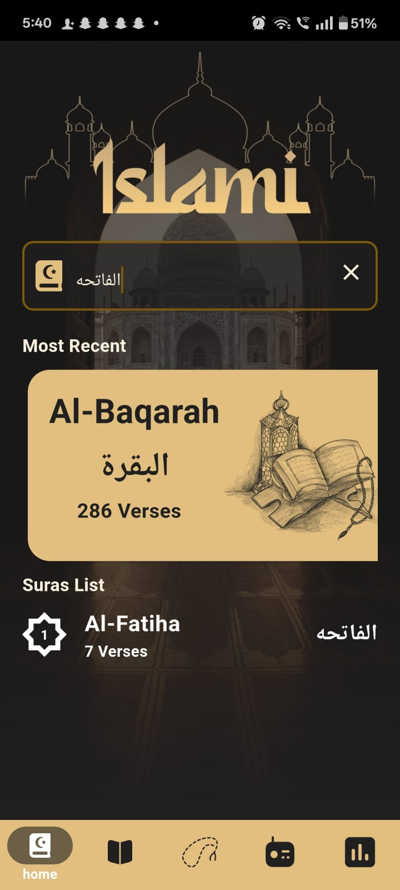
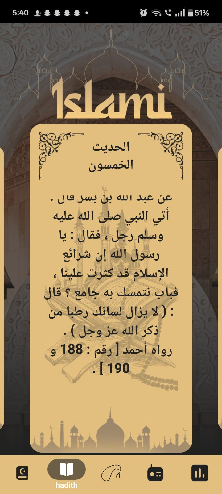
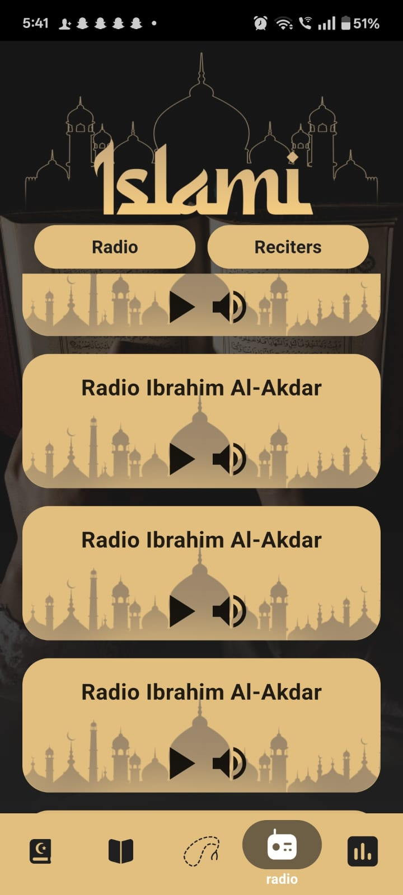
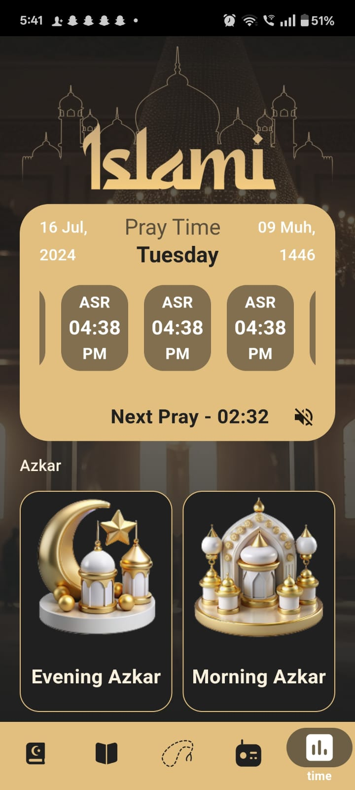

# Islamy App

**Islamy** is a Flutter application that offers essential Islamic features through a clean and user-friendly interface.

## 🕌 Features

- 📖 **Holy Quran** – Browse and read all Surahs.
- 📜 **Hadith** – Access a collection of authentic Hadiths.
- 📻 **Live Radio** – Listen to Islamic radio streaming.
- 🕒 **Prayer Times** – View accurate prayer times based on your location.
- 🧮 **Sebha** – Use the digital Tasbih counter.
- 🔍 **Search** – Quickly find Surahs and Hadiths.
- 🕰️ **Recent** – Access your most recently viewed content.

## 📸 Screenshots

### 📖 Quran Tab

### 🕰️ Most Recent

### 🔍 Search

### 📜 Hadith

### 🧮 Sebha

### 📻 Radio

### 🕒 Prayer Times

